

  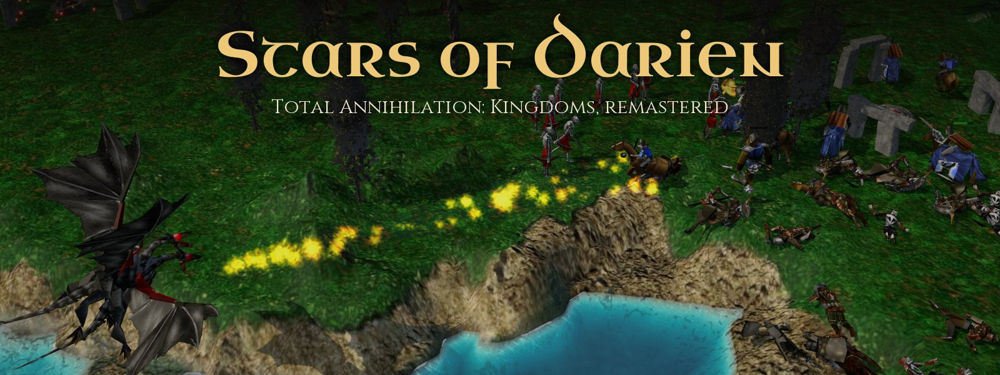

# Stars of Darien

A remaster of **Total Annihilation: Kingdoms**, the 1999 real-time strategy game by Cavedog Entertainment, made in Unity on the [OpenKingdoms](https://github.com/OpenKingdoms/OpenKingdoms) engine. The engine plays the game by the original's own rules, and Unity draws it again with sunlight and shadows, a new sea, weather, 3D models for the scenery the original only painted, and an interface built on the original's own screens. You play it with your own copy of the game. It is free and open source, and nothing is sold.

  
  
  

<table>
  <tr>
    <td width="50%">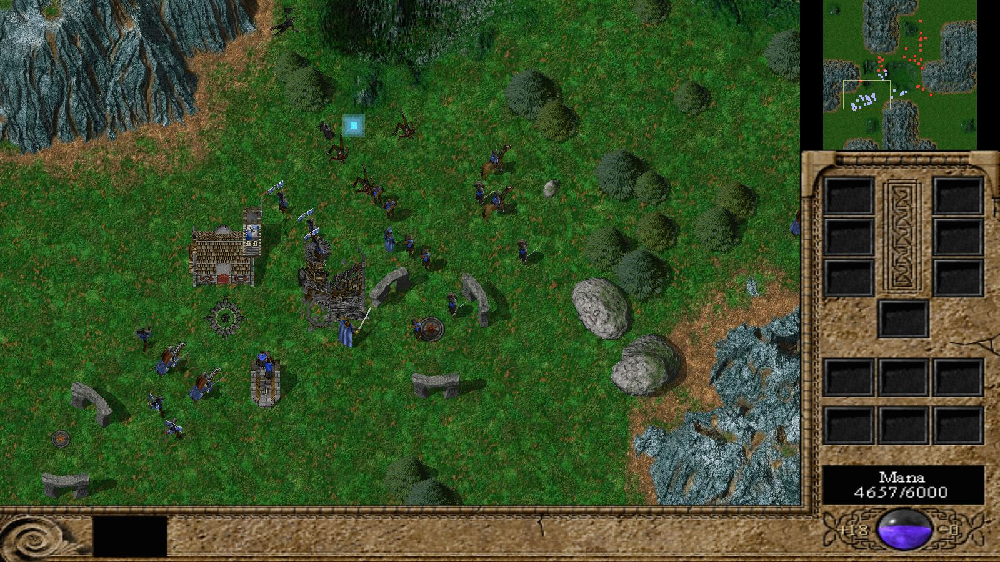</td>
    <td width="50%">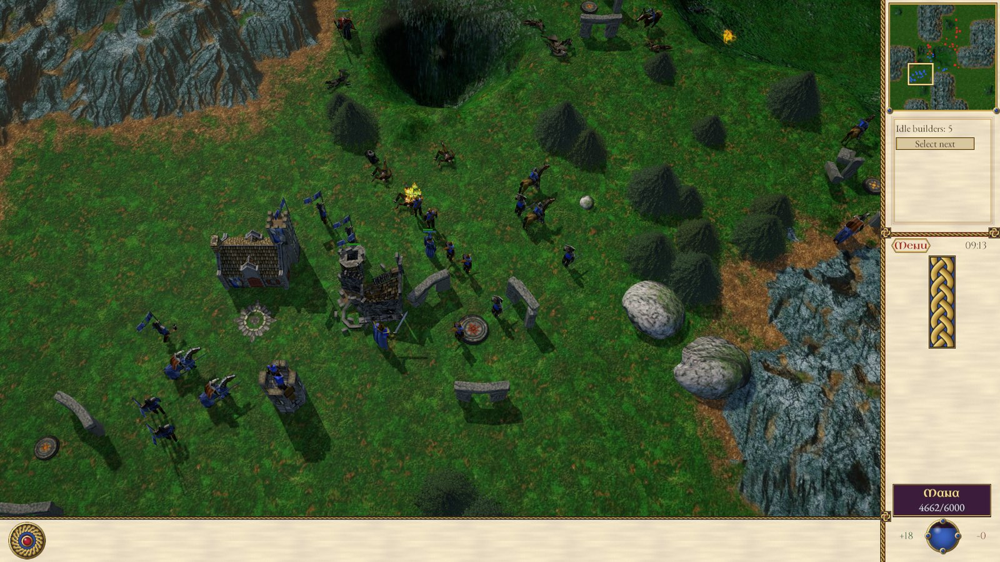</td>
  </tr>
  <tr>
    <td align="center">The classic view, as the original drew it</td>
    <td align="center">The same moment in Stars of Darien</td>
  </tr>
</table>

Both pictures show one battle. Stars of Darien saved it, and the OpenKingdoms engine loaded the save and drew it the way the 1999 game does.

---

## Get it

| | |
|---|---|
| **Source** | Clone this repository and open `unity/` in Unity 6000.3.25f1, on Windows or a Mac with Apple silicon. See [running it from source](#running-it-from-source) |
| **Alpha builds** | None public yet. Windows alpha builds are made for playtesters, and [Discord](https://discord.gg/zUTF2DSy5) is the place to ask about them |
| **The classic game** | [openkingdoms.net](https://openkingdoms.net/) plays it in a browser tab, on the same engine |

Every way in needs your own copy of the game.

---

## You need your own copy of the game

Stars of Darien contains none of the original game, and it never will. It reads the maps, units, models, sounds and music from your own installed copy of Total Annihilation: Kingdoms each time it starts. Nothing from that copy is stored in this repository or shared with anyone. Before the repository went public, its whole history was checked for game files and for pictures taken from the original, and it holds none.

The GOG edition works, and so does the game folder copied off the original CD.

On Windows the game looks for it in the GOG edition's folder, `C:\GOG Games\Total Annihilation Kingdoms`, and a built game also tries the other usual install places. If it finds nothing, it asks you where the game is and remembers the answer. On a Mac it looks in `~/Games/Total Annihilation Kingdoms`. In the Unity editor you can name another folder under OpenKingdoms, then Settings, and the `OK_GAME_DIR` environment variable wins over everything.

Without a copy, the game runs on a stand-in world with made-up maps and boxy soldiers. That is enough to work on the menus, the tools and new models.

---

## Status

| Area | State |
|---|---|
| Skirmish against the computer | Playable. All five kingdoms, the map browser, start positions, teams, up to eight players, computer opponents at four difficulties, line of sight, weather and game speed |
| Saved games | Save and load from the pause menu |
| Multiplayer | Works in the editor over the OpenKingdoms relay, and is shut in the alpha until it is ready for playtesters |
| Campaign | Not started. It comes after multiplayer, and a campaign for each kingdom after that |
| Platforms | Windows, and macOS on Apple silicon |

Alpha 1 is skirmish against the computer. Expect rough edges. [docs/ROADMAP.md](docs/ROADMAP.md) has the plan and what each step needs.

---

## What is new

### Formations

Select an army and drag a line on the ground with the right mouse button, as in Total War. Every unit's place is drawn on the ground before you let go, and the army walks into its ranks and faces the way the drag sets. You pick the shape, a line, a block, a wedge or a loose crowd, and whether the army keeps to the pace of its slowest soldier.

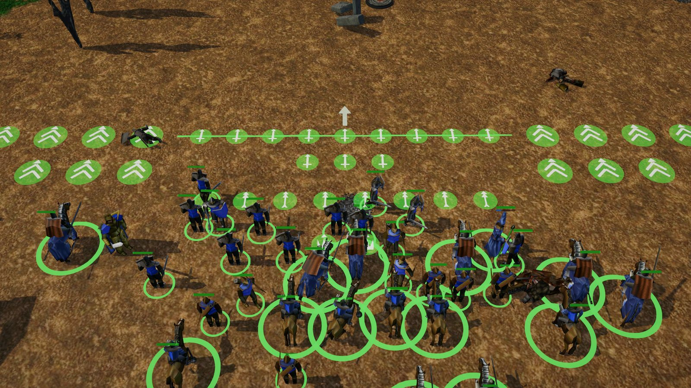

### Buildings rise from the ground

A building grows out of its foundation as its builders work, from the first moment, where the original kept it hidden until it was half done. Buildings can be turned before they are placed, with R, Shift+R, [ and ].

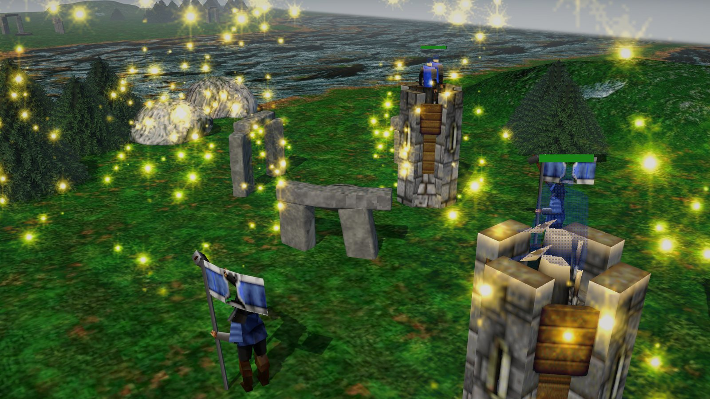

### Sea battles on new water

A new sea with surf along the shores and a wake behind every ship, and the fleets fight it out by the original's rules.

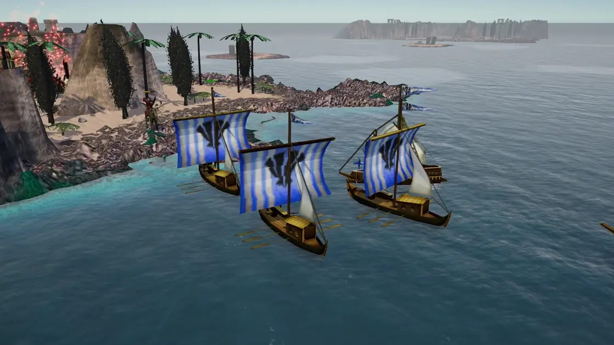

### Weather

Rain, snow and drifting mist, picked by the map's climate or set in the skirmish setup. Weather is only for the eye and changes nothing in the battle.

<table>
  <tr>
    <td width="50%">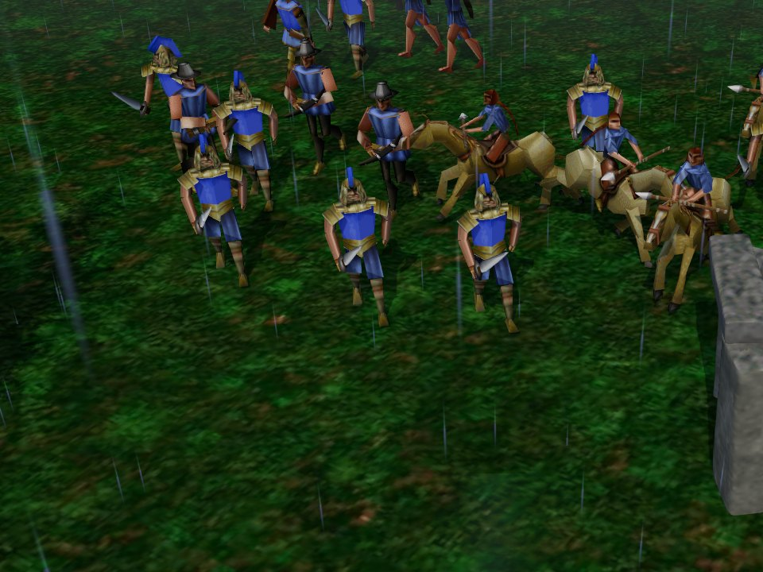</td>
    <td width="50%">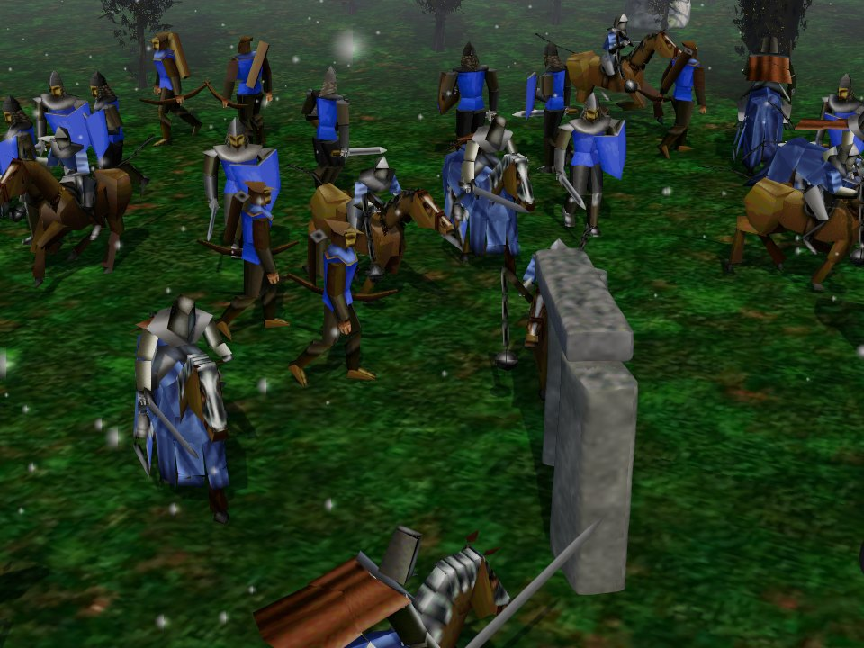</td>
  </tr>
  <tr>
    <td align="center">Rain</td>
    <td align="center">Snow</td>
  </tr>
</table>

### The scenery in 3D

Every tree, stone, ruin and lodestone the maps use stands as a 3D model on lit terrain. About three hundred are built by hand. The rest are carved models that the game paints when it loads, from your own game files, so no picture from the original is kept here.

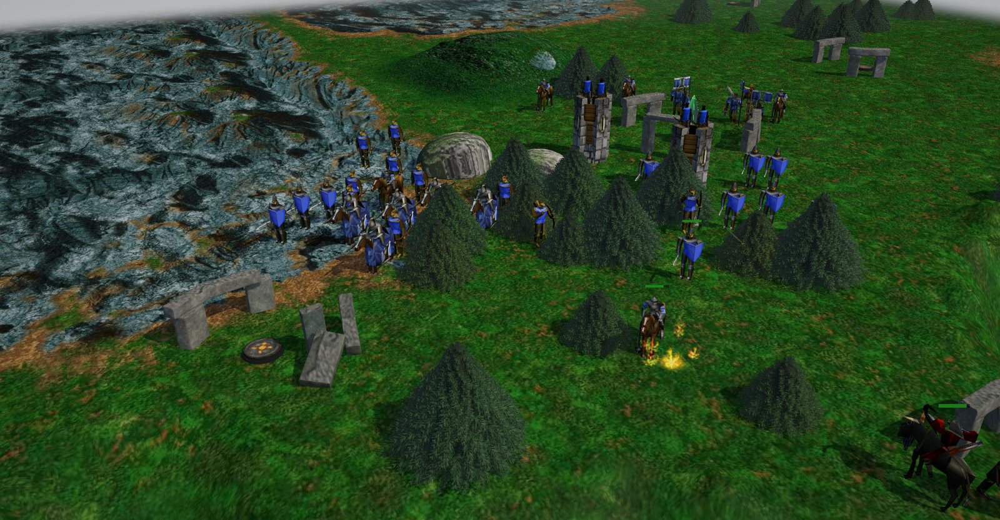

### The original's screens, remastered

The menus and the skirmish setup are the original's own screens, drawn from your game files and remastered with knotwork margins, new type and soft motion. The battle HUD keeps the original's layout in a Carolingian skin that scales to any screen.

<table>
  <tr>
    <td width="50%">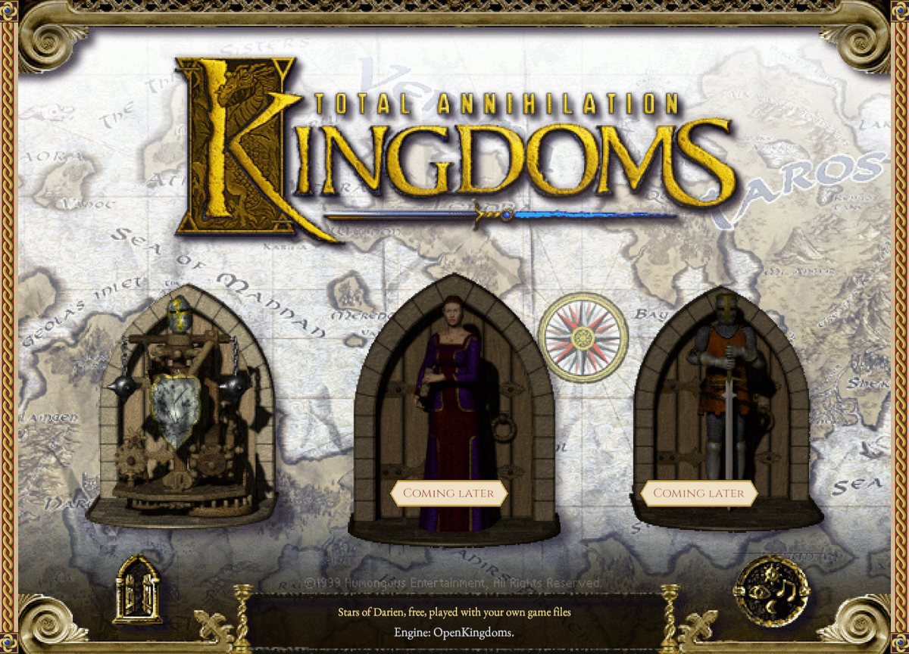</td>
    <td width="50%">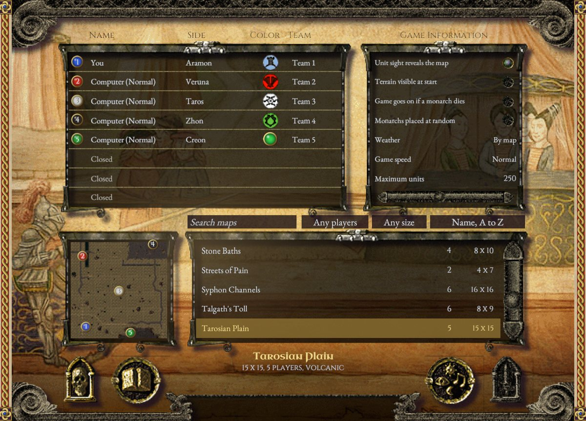</td>
  </tr>
  <tr>
    <td align="center">The main menu, doors and all</td>
    <td align="center">Skirmish setup with all five kingdoms seated</td>
  </tr>
</table>

### After the battle

Victory and defeat keep every tally the original shows, and add graphs of each army, its worth, income, mana and kills over time, a page for each kingdom, and the annals of the battle with its honours. Look at the field takes you back out onto the battlefield. [docs/BATTLE_RESULTS.md](docs/BATTLE_RESULTS.md) has the details.

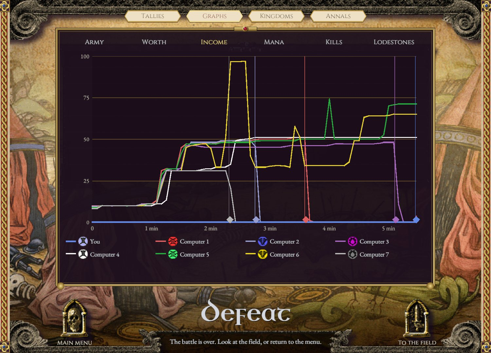

### Studio Mode, for artists

Studio Mode is a room inside the Unity editor for trying out models. Drop a glTF model in and it stands at the game's own scale, in the game's light, next to a monarch for size and next to the original it replaces. The studio checks it, fixes the common export slips with one click, puts it into the game with one button and starts a battle with it, so you see it in play. [docs/STUDIO_MODE.md](docs/STUDIO_MODE.md) is the guide.

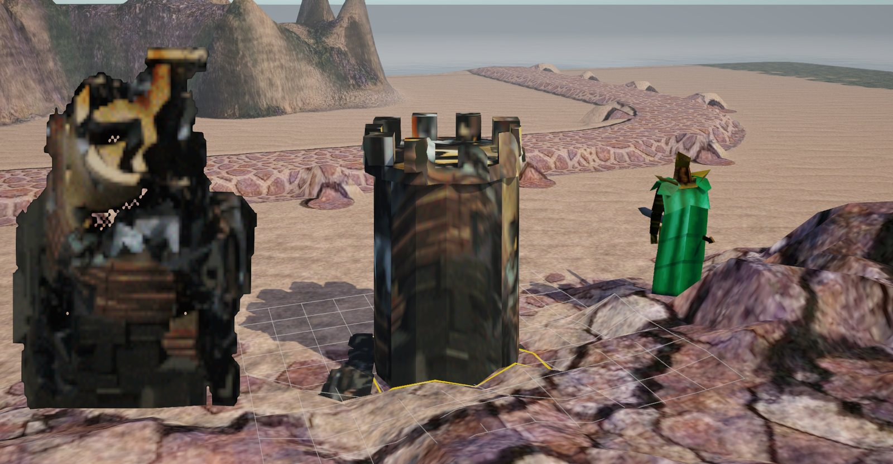

---

## Faithful where it counts

The OpenKingdoms engine runs every rule, so the economy, combat, magic and the AI follow the original as OpenKingdoms rebuilt it, and every unit moves by its own animation script from your game files. Unity draws, takes input, runs the interface and plays sound, and every order goes back through the engine. The controls are the original's too, with a few additions such as Shift to queue orders and see them, and build counts of five or without end on Shift and Ctrl. The units speak with their own voices, and the battle sounds and music are the ones from your game files.

F9 saves a picture of what you see, and Shift+F9 a short clip.

---

## Running it from source

1. Install Unity Hub and sign in. A free Unity Personal licence is enough.
2. Clone this repository and add its `unity/` folder in Hub. Hub offers to install the editor version the project needs, 6000.3.25f1.
3. Open the project and pick OpenKingdoms, then Play Remaster.

The engine library comes with the clone in `engine/`, built for Windows and for a Mac with Apple silicon, and the editor puts it in place when it starts, so there is nothing to build. If the engine can't run, the game says why and what to do instead of starting.

Where to read on:

- [docs/ITERATE.md](docs/ITERATE.md) covers playing, the tests and captures. `bash scripts/csharp-check.sh` compiles the scripts and runs the quick tests without opening Unity, and `scripts/unity-test.ps1` or `scripts/unity-test-mac.sh` runs the full EditMode and PlayMode suites.
- [docs/STUDIO.md](docs/STUDIO.md) describes the studio, the tools inside the editor for looking at the game's content and replacing it.
- [docs/STUDIO_MODE.md](docs/STUDIO_MODE.md) is the guide to Studio Mode.
- [engine/README.md](engine/README.md) says how the engine library is installed and published.
- [CLAUDE.md](CLAUDE.md) is the short version of the ground rules, written for AI coding assistants.

### How it is put together

- `unity/` is the Unity project. `Assets/Engine/OkEngine.cs` binds the engine's embedding API, and `EngineBackend.cs` offers the engine to the game through `IGameBackend`, which the stand-in engine also implements.
- `engine/` holds the released engine libraries, built from the OpenKingdoms branch `unity-embed`.
- `scripts/` builds and publishes the engine and runs the Unity tests.
- `tools/` holds the kit for hand-built models, the studio's helpers and the trailer director.
- `docs/` has the roadmap, the guide to playing and testing and the studio guides.

### Rules of the road

- The engine owns all game state and all randomness. Unity draws, takes input, runs the interface and plays sound, and every order goes back through the engine's own command queue. Nothing Unity draws feeds back into the game.
- `OkEngine.ApiVersion` matches the engine's `OKX_API_VERSION`. A change to the embedding API bumps both, and the new library is published to `engine/` in the same commit.
- Nothing from the original game is ever committed. That means no data files, sprites, models or sounds, and nothing extracted, painted or traced from them. The game reads them from the player's own copy at run time.

---

## Contributing

Changes come in as pull requests from a fork, and each one is reviewed before it is merged.

Models are the easiest way in, and you don't need to know any code. [docs/CONTRIBUTING-MODELS.md](docs/CONTRIBUTING-MODELS.md) walks an artist through it.

1. Fork the project on GitHub and clone your fork.
2. Make the model in Blender or any tool that exports glTF.
3. Check it in Studio Mode and press Use in game, which puts it in the right folder under the right name.
4. Commit it, push it and open a pull request.
5. An automatic check looks at it and anyone can review it. Once the maintainer or an art reviewer from the community approves it, it is merged, and a merged model is in the game for everyone.

One Blender unit is one cell of the map, which is 16 pixels of the original. In Blender's Imperial units with Unit Scale 1.0, one pixel of the original is 2.4606 inches and a cell is 39.37 inches. A monarch stands 4 cells tall, and Studio Mode stands one beside your model.

Code follows [CONTRIBUTING.md](CONTRIBUTING.md). For anything bigger than a small fix, open an issue first and say what you plan. Everyone follows the [Code of Conduct](CODE_OF_CONDUCT.md).

---

## Built on OpenKingdoms

The game's rules live in [OpenKingdoms](https://github.com/OpenKingdoms/OpenKingdoms), an open source reimplementation of Total Annihilation: Kingdoms in C that runs on Windows, macOS, Linux and in the browser. [openkingdoms.net](https://openkingdoms.net/) plays the classic game in a browser tab with your own game files. Stars of Darien loads the same engine as a library, so a fix to the rules there reaches this game too. Changes to the engine go to the OpenKingdoms repository.

---

## Licence

Stars of Darien is free software under the GNU General Public License, version 3 or any later version, in [LICENSE](LICENSE), with an additional permission to combine it with the Unity engine, in [LICENSE.unity-exception](LICENSE.unity-exception).

Opening a pull request shares your work under those terms, the Unity permission included. Sending in a model or a texture also confirms that it is your own work or that you have the right to share it, and gives OpenKingdoms the right to use it in Stars of Darien.

SDL 2 keeps its zlib licence, and the fonts Cinzel, EB Garamond and Uncial Antiqua keep the SIL Open Font License.

*Total Annihilation: Kingdoms* and everything in it belong to their owners. This project is not affiliated with, endorsed by or supported by Cavedog Entertainment or any current rights holder. No game files are distributed here.

---

## Credits

Total Annihilation: Kingdoms was made by Cavedog Entertainment and came out in 1999. Stars of Darien exists because of it.

<table>
  <tr>
    <td align="center" valign="top" width="20%">
      <a href="https://github.com/zbennett10"> <b>Zachary Bennett</b></a> 
      project lead
    </td>
  </tr>
</table>

The engine is the work of the [OpenKingdoms contributors](https://github.com/OpenKingdoms/OpenKingdoms#contributors). A merged pull request puts you here. See [Contributing](#contributing).
