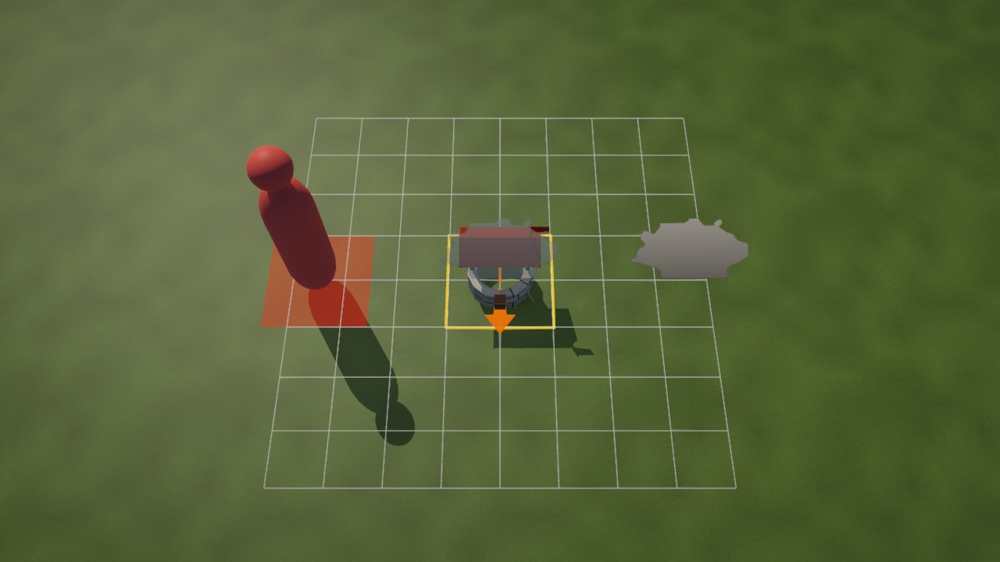
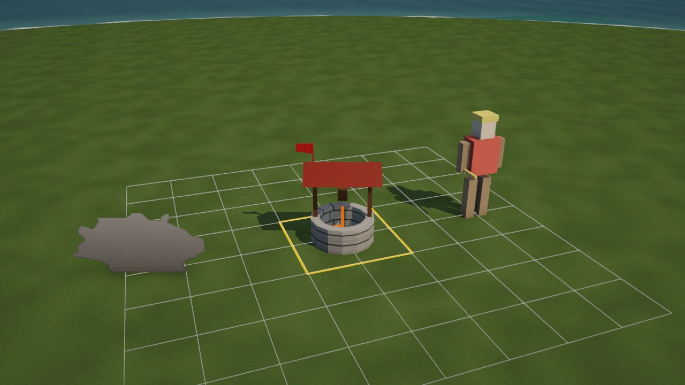
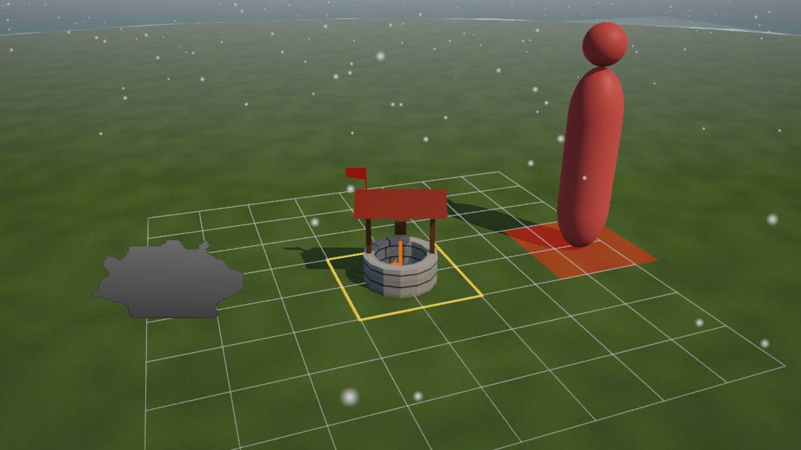
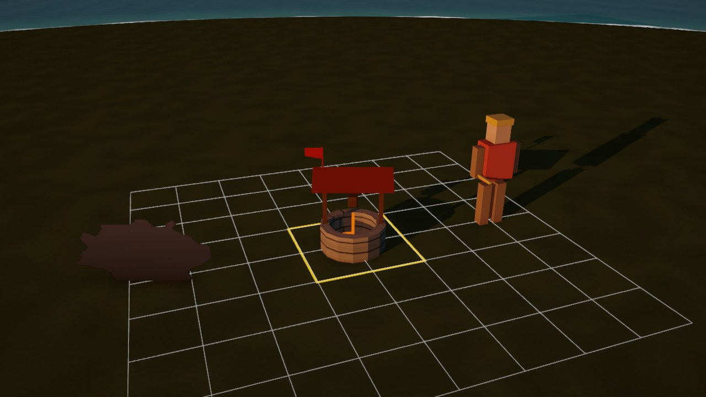
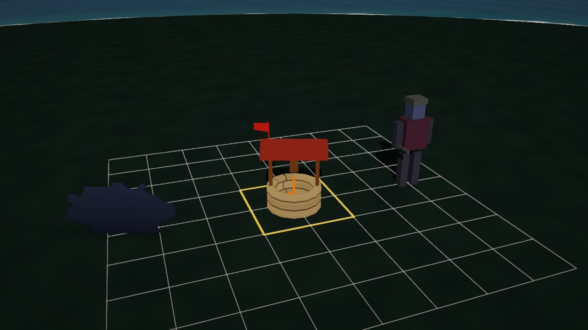
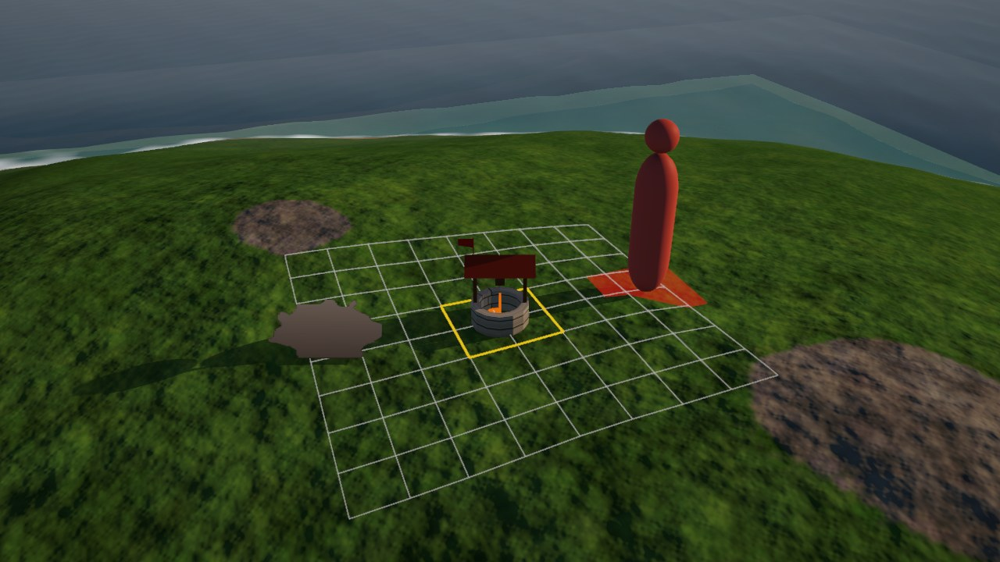

# Studio Mode

Studio Mode is a room inside the Unity editor for trying out models for the game. You drop a model in, and it stands on a turntable at the game's own scale, in the game's light, next to a monarch for size and next to the thing it is meant to replace. The studio checks it, fixes the common export slips with one click, puts it into the game with one button, and starts a battle with it so you can see it in play.

You don't need to write any code, and you don't need the original game. With the game installed, the studio shows the real maps, the real units and the original models and pictures to compare against. Without it, the studio runs on a stand-in world with made-up maps and boxy soldiers. You can still bring models in, look at them in the game's light, check and fix them, and put them in the game under their real names by typing the name in. Comparing with the originals and playing on the real maps need the game.

## Setting up, once

1. Make a GitHub account if you don't have one. Open github.com/OpenKingdoms/Stars-of-Darien and press Fork. GitHub makes a copy of the project under your account, and that copy is where your work goes.
2. Install GitHub Desktop from desktop.github.com and sign in with that account. Choose File, then Clone repository, pick your fork (`your-name/Stars-of-Darien`), and clone it into a folder such as `C:\Projects`. When GitHub Desktop asks how you plan to use the fork, pick To contribute to the parent project.
3. Install Unity Hub from unity.com/download and sign in. Unity asks for a license the first time, and the free Personal license is the one to pick.
4. In Hub, choose Projects, then Add, then Add project from disk, and pick the `unity` folder inside the clone (for example `C:\Projects\Stars-of-Darien\unity`). The project needs Unity 6000.3.25f1 exactly. Hub notices when it is missing and offers to install it. No extra modules are needed.
5. Open the project from Hub. The first open imports everything and takes several minutes. Later opens are quick.

Two things are optional. If you own Total Annihilation: Kingdoms (the GOG edition), pick OpenKingdoms, then Settings, and point Game folder at where it is installed. The default is `C:\GOG Games\Total Annihilation Kingdoms`, so a default GOG install needs nothing. For making models, Blender works well, and any tool that exports glTF or FBX will do.

The game's engine is a Windows library. On a Mac the studio runs on the stand-in world only.

## Opening and leaving

Pick OpenKingdoms, then Studio Mode. The editor opens the studio's own scene and lays out three windows. The Studio View opens as a tab beside the Scene view and shows the stage. The Studio panel opens beside the Inspector and holds everything you can change. Studio Drop opens beside the Project window at the bottom, and is where models come in. Each of them is also under OpenKingdoms, then Studio, if you close one by mistake.

The line at the top of the Studio panel says whether the studio is on the real game or on the stand-in world. When it is on the stand-in world without you asking, a box under it says why and what to do. Use the stand-in world, beside it, switches to the stand-in world even with the game installed, which starts quicker. Untick it to go back.

On the real game the studio loads a map before it shows the stage. Unity waits behind a progress bar while it does, which can take a minute or two the first time.

To go back to normal, pick OpenKingdoms, then Leave Studio Mode, or press the button at the bottom of the Studio panel. Your scenes and your window layout come back as they were.

Nothing you do in the studio changes the scenes you were working in. If you open another scene while Studio Mode is on, Studio Mode ends there and leaves that scene alone. Leave Studio Mode then puts your window layout back. If you close Unity in Studio Mode, pick Leave Studio Mode after it opens again to get your layout back.

## What is on the stage

Your model stands in the middle on a turntable. With the game installed, a monarch from the game stands to its left for scale. The original, the thing your model replaces, stands to the right once you have picked it.

On the ground, white lines mark the map's cells around the model and a yellow outline marks the footprint, the cells the original takes up on the map. An orange pin marks the anchor, the point the game stands the model on, and an orange arrow points south, the way the model's front must face.

The Studio View has two views. Classic view is the game's own camera, looking north and down at the angle the original draws everything, and in it a pale blue ghost of the original lies over your model so you can match its outline. The classic view always shows your model as it will stand in the game, however far the turntable has turned it. Free view lets you look from anywhere. Drag to turn around the model, use the wheel to zoom, and Turn starts or stops the turntable. The toolbar also has a zoom slider, Reset, and Screenshot.

## Bringing a model in

There are four ways, and they all do the same thing.

- Drag a `.glb`, `.gltf`, `.fbx` or `.obj` file onto Studio Drop or onto the Studio View, from Explorer or from Unity's Project window.
- Press Pick a file on Studio Drop.
- Save or export straight into `unity/Assets/Overrides/Drop` in the clone. Open the Drop folder opens it for you. A model saved there shows up by itself within a second or two, and the folder's models are listed on Studio Drop so you can switch between them.
- Press Load the sample to try the studio with a small stone well.

Once a model is loaded, the studio keeps an eye on its file. Keep Blender open, export over the same file, and the studio reloads it within a second, with your fixes and material changes kept. For a `.gltf` it also watches the `.bin` and the pictures beside it. If an export can't be read, the studio says why and waits for the next export.

glTF Binary (`.glb`) is the best format, because the pictures travel inside the file and it is what the game reads. In Blender, choose File, then Export, then glTF 2.0, and keep the format at glTF Binary and +Y Up ticked, which are the defaults. Leave Compression unticked, because the game can't read compressed files. FBX and OBJ files go through Unity's own importer, and the studio turns them into a glb for the game. An FBX or OBJ from outside the project is copied into `Overrides/Drop/Imported` first, with the pictures beside it or in a `textures` folder next to it that it names. A picture it names that isn't there shows up as a warning. A `.gltf` with its `.bin` and pictures beside it is packed into one glb the same way.

## Scale, anchor and facing

One Blender unit (one metre) is one cell of the map, and a cell is 16 pixels of the original game. A monarch is 4 cells tall. Use the monarch beside your model to judge size, and the checks below compare it with the original.

The model's origin is its anchor. Put the origin in the middle of the model's base, on the ground, at 0, 0, 0. The studio can do this for you, but getting it right in Blender saves a step every time.

The front of the model faces south, toward the classic camera. In Blender that is the side you see in Front view (numpad 1), which is the -Y side. If you see the back of your model in the classic view, give it a half turn.

## Picking what it replaces

The Replaces part of the Studio panel has three tabs, a search box and a way to type a name in.

Feature lists the trees, rocks, ruins and other things that stand on the maps. With the game installed, the studio stands the original picture upright beside your model at the size the game draws it, and lays its ghost over your model in the classic view. If the feature isn't on the studio's map, the studio places one out of sight for a moment to read how the game draws it.

Unit lists every unit. Your model replaces the whole unit. The unit's original model stands beside yours, and any part of your model named like one of the original's pieces (for example `torso`, `head` or `larm`) moves with the original's animation. The checks list the piece names.

Unit card lists the units that stand on a painted card, which are the lodestones, the divine lodestones, the Zhon sacred fire and glyph, and Thesh's stand. Your model takes the card's place and the unit keeps everything else. The studio picks the card piece for you, which for a lodestone is the piece named after it, such as `aralode`. The original then shows around your model with the card taken out, and the ghost shows just the card.

If your file is named like a feature or unit, for example `AraTree01.glb` or `ARALODE.glb`, and nothing is picked yet, the studio picks it for you as soon as the model loads.

Type it in, under the list, is for anything the list doesn't have, which on the stand-in world is everything from the real game. For a feature, type its name as the game has it (such as `AraTree01`), the cells it covers on the map, and how tall it stands in the game in cells. For a unit, type its model name (such as `ARAKING`). Then press Use this. The checks go by the numbers you typed, and Use in game writes the model under that name.

The stand-in world's own features and units are made up and not to scale, so the studio doesn't judge your model's size against them. A monarch in the game stands 4 cells tall, and the footprint grid's lines are a cell apart.

## Checks and fixes

The Check part of the Studio panel lists what the studio found, in plain words. A green tick is fine, a blue note is for your information, a yellow warning is worth a look, and a red problem has to be sorted out before the model can go into the game. A red problem is usually that nothing has been picked under Replaces yet.

Some warnings come with a button that fixes them.

| Button | What it does |
| --- | --- |
| Centre it on the anchor | Moves the model so the middle of its base is on the anchor and its lowest point is on the ground |
| Match the original's height | Scales the model to the height the game draws the original at, or to the original model |
| Fit it to the footprint | Scales the model to the width of the footprint, for features with no known height |
| Make it 100 times smaller | For a model exported in centimetres |
| Turn it a quarter | For a model that lies across the other way from the original |

The height check says where its number comes from. When the studio has only the feature's definition to go by, it says the number is a rough guide, since the game often draws a feature shorter than its definition says.

Below the list, Turn left, Turn right and Half turn turn the model by quarters, Scale sets its size by hand, Centre centres it on the anchor, and Undo fixes goes back to the model as exported. Fixes never change your own file. They are applied to the copy that goes into the game.

The studio also warns when a feature or card model has more than 3,000 triangles or a unit more than 6,000, since a map can show hundreds of them at once. It warns about pictures larger than 1024 pixels on a side, pictures in a format the game can't read (use PNG or JPEG), pictures a model names that are not there, and see-through pictures on a material set to opaque. For leaves, fences and anything else with see-through parts, plug the picture's Alpha into the shader's Alpha in Blender, and the game cuts those parts out.

## Putting it in the game

Press Use in game. If there are warnings, the studio lists them and asks first, and if a model for that thing is already in the game it asks before replacing it. The model goes to the place the game looks for it, with the fixes and, if Keep the material changes is ticked, the material changes baked in.

| Replaces | Written to |
| --- | --- |
| A feature | `unity/Assets/Overrides/Features/<feature>.glb` |
| A unit | `unity/Assets/Overrides/Units/<MODEL>.glb` |
| A unit card | `unity/Assets/Overrides/Units/<MODEL>.glb` and `<MODEL>.json` beside it, naming the card piece it stands in for |

Use in game copies the model into the game as it is at that moment. After you export again, press Use in game again so the game gets the new one.

Then press Play here. It stays greyed out until Use in game has put the model in. For a feature, the studio starts a skirmish on a map where that feature stands, or on the studio's map when it doesn't know one, and places three of your model just south-east of your starting position on the flattest ground there, a footprint apart, with the camera over them. For a unit, you play as the unit's kingdom on the studio's map. Monarchs and starting units are there from the start, and anything else your builders can build. Stop Play to come back to the studio just as you left it.

Pressing Play in the editor while Studio Mode is on starts the game from its main menu, the same as OpenKingdoms, then Play Remaster.

## Experimenting

The Look part of the Studio panel changes the stage, not your model. Ground picks a neutral island or a real map's terrain. Climate changes the ground's colour and the sky to grass, snow, desert, swamp or volcanic. Sea turns the water around the neutral island on or off. Weather adds rain, snow or fog, Time of day moves the sun from morning to night, and Shadows turns shadows off and on. Team colour tints any material with "team" in its name, to preview a player's colour on it. The game itself does not tint drop-in models yet.

The Material part changes your model. Tint and Brightness change its colour, Roughness makes it shinier or duller (untick Keep own roughness first), and Self light makes it glow, for braziers, crystals and magic. Reset the material puts it back. With Self light at 0, a glow you set in Blender shows as it will in the game. The game draws a glow as the brightest part of the emission colour over the part's own colour, so an orange glow on a black surface shows little. Give glowing parts a bright colour of their own.

The Show part turns the monarch, the grid, the anchor, the original and the ghost on and off. Screenshot, classic and Screenshot, free save a 1920 by 1080 picture into the capture folder, the same one F9 uses (see Sharing what you see), and Open the capture folder opens it. Frame it in the Scene view points Unity's own Scene view at your model, if you want Unity's tools on it.

## The gallery

The gallery shows every model in a folder at once, on the studio's ground and in its light and weather. Press Gallery on the Studio panel or on the Studio View's toolbar, or pick OpenKingdoms, then Studio, then Gallery. It opens as a tab beside the Studio View.

Each model stands at game scale on a small plinth of its own with its name floating over it. The plinths run in rows by name, left to right and then toward the camera. Each row and each column is as wide as its biggest model, so nothing overlaps however big one of them is. With the game installed, a monarch from the game stands on a plinth at the start of the first row for scale.

Folder, at the left of the toolbar, picks what to show. It starts on `Overrides/Generated/Units` and offers `Overrides/Generated`, `Overrides/Features` and `Overrides/Units`, or any folder through Pick a folder, and it remembers the last one. The search box beside it narrows the grid to the models whose names contain what you type, in any case.

The view starts over the whole grid. Click a model to fly to it, and it turns on the spot like the turntable, in either view, until you untick Turn. The right and left arrow keys, or N and P, fly to the next and the previous model in the grid's order, and Home or Escape goes back to the overview. Classic view and Free view work as they do in the Studio View. In the classic view a drag pans across the grid, in the free view it turns round the model, and the wheel zooms in both.

Compare originals stands the thing each model replaces beside it on the same plinth, the original model for a unit or a 3D feature and the picture as the game draws it for a sprite feature. The gallery finds the original by the file's name, as the studio does when you drop a model in. It needs the game installed, since the stand-in world has none of the real originals. A model named after nothing the game has says "no original" under its name.

The gallery keeps an eye on the folder. Export over a model and it reloads where it stands within a second or two. A new file takes its place in the grid, and a deleted one leaves it. When many change at once, such as a whole folder made again, the gallery reads them in the background and reloads them nearest the camera first, within the same time and memory limits as when it opened, so the editor keeps going.

A folder can hold hundreds of models. The gallery reads their sizes from the files first, which is quick, sets out the plinths, and then loads the models nearest the camera first, a few each frame, so the editor never stops for long. A bar at the top of the view shows how far it has got, and a see-through box stands in for each model until it loads. When the loaded models' pictures and meshes would take more than about 1.5 GB, the ones far from the camera wait until it comes near them, and the farthest are let go to make room. A model that can't be read shows a red box and "did not load" under its name.

Screenshot on the gallery's toolbar saves the view as it is into the capture folder, the same as F9 (see the next part). Closing the gallery's tab lets its models go. A gallery tab left open behind another keeps its models loaded. The gallery also lets them go when you press Play and when Unity reloads scripts, and loads them again when you come back to it, which takes about half a minute for 700 models.

## Sharing what you see

F9 saves a picture of what you are looking at, and Shift+F9 records about five seconds of it at 12 frames a second. Both work in the game, whether it runs from Play Remaster, from Play here or as a built copy, and in the Studio View and the gallery. In the game the picture is the whole game screen, menus and all, without the editor around it. In the studio it is the view as drawn, without the toolbar. A note at the top of the screen, or over the window in the studio, says where each capture went. The game keeps its note off the screen while a clip records, so none of the frames has it.

A picture is saved as `shot-YYYYMMDD-HHMMSS.png`. A clip is a folder `clip-YYYYMMDD-HHMMSS` holding `frame-001.png` to `frame-060.png`, and beside it a contact sheet `clip-YYYYMMDD-HHMMSS.png` with every frame in a grid, each with its number and its time from the start. The sheet is at most 2048 pixels wide, so the whole movement can be read from one picture. `LATEST.txt` in the same folder holds the full path of the newest picture or contact sheet.

Captures go to `D:\OKBuild\owner-shots` on a computer that has a `D:\OKBuild` folder, and to the `Captures` folder at the top of the clone otherwise, which never leaves your computer. OpenKingdoms, then Settings, changes where for the editor, which covers Play and the studio. A built copy of the game doesn't see that setting. It uses the `OKU_SHOTS_DIR` environment variable when it is set and the same default otherwise, or a `Captures` folder in its own data folder when there is no `D:\OKBuild`. The picture is read back and written in the background, so a capture hardly holds the game up. The first picture after pressing Play also reads the screen once the slow way, to learn which way up it comes back, and a clip on a 4K screen is a lot of work for the writer, which can take a few seconds after the clip to catch up.

The keys are F9 and Shift+F9 because the original game gives F12 to clearing the chat and keeps F9 free for its own screenshots. In the Unity editor the game hears keys only while the Game view has focus, and the studio only while the Studio View or the gallery has focus.

## Settings

OpenKingdoms, then Settings, holds the few things the studio needs to know about your computer. Game folder is where the original game is installed, and Browse picks it. The box under Engine says in plain words whether the real game and your game files will be used, or the stand-in world and why. Use these settings now applies a change to the open studio at once, without restarting Unity. It leaves Use the stand-in world as you set it.

Under Captures, Capture folder is where F9 pictures and Shift+F9 clips go. Browse picks another folder, Default goes back to the default, and Open shows the folder. The `OKU_SHOTS_DIR` environment variable wins over this setting.

Under Tools, both settings are optional. Sprite catalog is a folder that `tools/sprite-replace/extract.py` makes from your game files, listing every sprite feature with its picture. Making it needs Python, and the studio works without it. Blender is where `blender.exe` is, for the other studio windows that open Blender. The studio finds it by itself when Blender is installed in the usual place.

## Sharing your work

Models you put into the game with Use in game land in `unity/Assets/Overrides/Features` and `unity/Assets/Overrides/Units`, and those folders are shared through GitHub. To send them in, open GitHub Desktop, make a new branch named after what you made (Branch, then New branch), tick only your model files and their `.meta` files in the list of changes, write a line about them, press Commit, then Push. Then press Create Pull Request and fill in the form GitHub opens. The maintainers review it, and once they merge it the model is in the game for everyone. `docs/CONTRIBUTING-MODELS.md` walks through it step by step.

For a unit card, also tick the `.json` file beside the model and its `.meta` file. Without the `.json`, the game on everyone else's computer takes your card model for a whole unit and the unit loses its other pieces.

If Unity changes any of its own settings files when it opens the project, they show up in GitHub Desktop too. Leave those unticked, and use Discard changes on them if they get in the way.

The Drop folder, the Captures folder and `Overrides/Generated` never leave your computer, so you can try anything there. Nothing from the original game goes into the shared folders, not its pictures, not its models, and nothing painted or traced from them. The original is there to size and place your model against, never to copy from. The studio refuses to put in the models the sprite tools make from your own game files.

## Keeping up to date

On your fork's page on GitHub, press Sync fork, then Update branch. Then in GitHub Desktop, switch to the `main` branch, press Fetch origin and then Pull when it offers. Unity picks up the changes when you switch back to it. A pull can bring a new build of the game's engine. Unity puts it in place by itself, and if it already has the old one loaded, it shows a message saying the engine was updated and asks you to restart. Save your work and let it restart. Until then the studio uses the stand-in world.

## When something looks wrong

- The model is huge or tiny. It was probably exported in centimetres, or at the wrong scale. Use the fix button, or set the scale in Blender to 1 unit per metre.
- The model lies on its back or on its face. Export as `.glb` with +Y Up ticked. FBX files from some tools carry a turn the studio can't always undo.
- You see the back of the model in the classic view. Press Half turn.
- The model floats or sinks. Press Centre it on the anchor, or move the origin to the bottom of the model in Blender.
- Parts are missing or look inside out. Check the face normals in Blender (Mesh, then Normals, then Recalculate Outside).
- A part looks plain grey or white. Its picture was not found. Export as `.glb` so the pictures travel inside, or keep the pictures beside the `.fbx` or `.obj`.
- The model doesn't load and the message mentions compression. Untick Compression in Blender's glTF export and export again.
- The original isn't beside your model. The message under Replaces says why. On the stand-in world the originals aren't there, and on a real map the studio says when it couldn't place one.
- The studio says it runs on the stand-in world when you have the game. Open OpenKingdoms, then Settings, and read the box under Engine. It says what is missing.
- The box says the Microsoft Visual C++ runtime is missing. The engine needs it and most PCs with games on them already have it. Install it from the link in the message and restart Unity.
